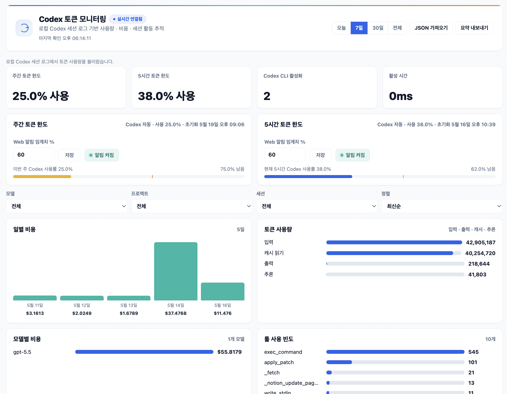

# Codex 토큰 모니터링

로컬 Codex 세션 로그와 Codex 한도 정보를 모아 토큰 사용량, 비용, 세션 활동, 주간/5시간 한도 사용률을 한 화면에서 확인하는 로컬 대시보드입니다.



## 한눈에 보기

- Codex `/status`와 같은 한도 원천을 자동 동기화해 주간 토큰 한도와 5시간 토큰 한도를 분리 표시합니다.
- 각 한도별 Web 알림을 독립적으로 켜고 끌 수 있습니다.
- 로컬 Codex 세션 로그를 기반으로 비용, 모델, 프로젝트, 세션, 툴 사용량을 집계합니다.
- Server-Sent Events로 데이터 변경을 감지해 브라우저 화면을 자동 갱신합니다.
- JSON 가져오기와 요약 내보내기를 지원합니다.

## 요구 사항

- Node.js 20 이상
- 로그인된 Codex CLI
- Web Notification을 지원하는 브라우저, 한도 알림을 사용할 때 필요

## 빠른 시작

```bash
npm start
```

브라우저에서 아래 주소를 엽니다.

```text
http://127.0.0.1:4000
```

## 데이터 동기화

대시보드는 두 종류의 데이터를 사용합니다.

- 세션 사용량: 로컬 Codex 세션 로그에서 토큰, 비용, 모델, 툴 사용량을 집계합니다.
- 한도 사용률: Codex app-server의 `account/rateLimits/read` 응답을 읽어 `/status` 기준의 주간/5시간 한도 사용률을 가져옵니다.

Codex 세션 사용량을 한 번 동기화합니다.

```bash
npm run sync:codex
```

Codex 세션 사용량을 계속 동기화합니다.

```bash
npm run sync:codex:watch
```

Codex 한도 정보를 한 번 동기화합니다.

```bash
npm run sync:limits
```

Codex 한도 정보를 계속 동기화합니다.

```bash
npm run sync:limits:watch
```

한도 정보는 기본적으로 30초마다 갱신됩니다. 갱신 주기를 바꾸려면 환경 변수를 지정합니다.

```bash
CODEX_LIMITS_SYNC_INTERVAL_MS=60000 npm run sync:limits:watch
```

## PM2로 실행

대시보드 서버, 세션 로그 동기화, `/status` 한도 동기화를 함께 실행합니다.

```bash
pm2 start ecosystem.config.cjs
```

상태와 로그를 확인합니다.

```bash
pm2 list
pm2 logs codex-monitoring
pm2 logs codex-usage-sync
pm2 logs codex-limits-sync
```

## 화면 구성

- 상단 요약: 실시간 연결 상태, 기간 필터, JSON 가져오기, 요약 내보내기
- 핵심 지표: `/status` 기준 주간 한도, 5시간 한도, Codex CLI 활성화, 활성 시간
- 한도 패널: 알림 임계치, 한도별 알림 on/off, 사용률 진행 막대
- 분석 패널: 일별 비용, 토큰 사용량, 모델별 비용, 툴 사용 빈도

## 테스트

```bash
npm test
```

## 프로젝트 구조

```text
.
├── index.html                    # 대시보드 마크업
├── src/
│   ├── app.js                    # 브라우저 앱, 렌더링, 실시간 갱신, 알림
│   └── usage.js                  # 사용량 정규화, 필터링, 요약
├── scripts/
│   ├── server.js                 # 로컬 HTTP 서버와 SSE 엔드포인트
│   ├── sync-codex-usage.js       # 로컬 Codex 사용량 로그 동기화
│   └── sync-codex-limits.js      # Codex 토큰 한도 동기화
├── tests/                        # Node.js 테스트
├── docs/
│   └── page.png                  # README 화면 예시
└── data/                         # 생성된 로컬 스냅샷, git 제외
```

## 보안 주의사항

`data/` 아래 생성 파일에는 로컬 세션 메타데이터가 포함될 수 있어 git에서 제외합니다. 시크릿, 인증 정보, 원본 프롬프트, 원본 응답, 고객 정보, 내부 인프라 정보는 커밋하지 마세요.

## Git 포함/제외 기준

- 포함: 앱 소스, 테스트, 실행 스크립트, README, 화면 예시 이미지
- 제외: `node_modules/`, 빌드/커버리지 산출물, 로그, `.env*`, 인증서/키 파일, `data/*.json`
